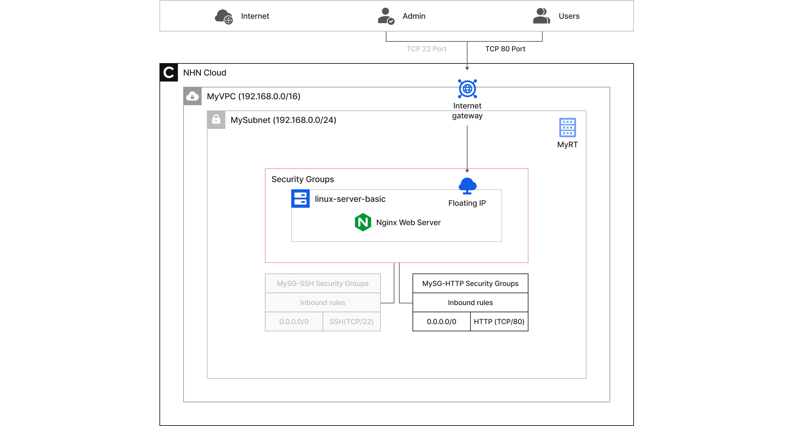
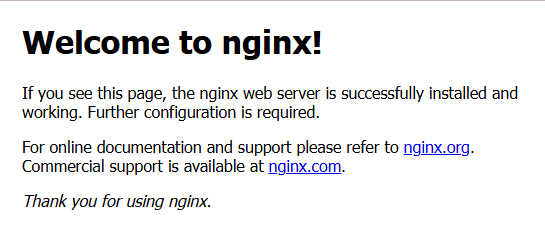

<!-- pre-align:aligned sig=38a5ba220ced -->

# Configure security
**Quickstarts > 5. Configure security**

In this learning module, you will learn how to build a secure and reliable cloud environment by walking through the basic concepts and key features of setting up and managing security in NHN Cloud. NHN Cloud provides a variety of security features to keep your data safe and secure, and to manage your cloud resources efficiently.


<a id="learning-objectives"></a>
## Learning objectives { #learning-objectives }

In this learning module, you'll learn to

* **Network security settings**
    * Network isolation and protection with VPC and subnet configuration
    * Allow only authorized traffic through security groups and access control lists (ACLs)
* **Secure your data**
    * Data encryption methods and storage security settings provided by NHN Cloud
    * Backup and recovery strategies for data loss
<br></br>



<p style="text-align: center; color: black;">Final configuration diagram</p>

<a id="before-you-begin"></a>
## Before you begin { #before-you-begin }

To get started with NHN Cloud, you'll need to prepare the following things

* **Standard Internet browser**
    * You must have the latest version of a browser installed, such as Google Chrome, Microsoft Edge, Firefox, or Safari.
    * JavaScript and cookies must be enabled in your browser settings.
* **Internet connection environment**
    * A stable internet connection is required, with a recommended bandwidth of at least 5 Mbps.
    * You must be able to communicate securely over HTTPS.

**This guide starts with the steps after [4. Network setup and create instance](https://docs.nhncloud.com/en/quickstarts/en/network-setup/).**

> In this learning module, you'll learn how to set up different security settings through four scenarios.

<a id="scenario-1-apply-security-rules-to-a-web-server-instance-to-allow-external-access"></a>
## Scenario 1. Apply security rules to a web server instance to allow external access { #scenario-1-apply-security-rules-to-a-web-server-instance-to-allow-external-access }

1. From the top menu of the NHN Cloud console, select the organization`(MyORG`), project`(MyPRJ`), and `Korea (Pyeongchon) region`that you want to use for your lab.
2. In the left menu, click **Network - Floating IP**.
3. **Copy** and **record**the IP address in the floating IP resource list where the connected device `is linux-server-basic`.
4. Open a new window in your web browser and enter `http://the copied linux-server-basic floating IP address`to confirm your connection.
> [Note]
**When you connect to that web server, you don't see any web pages.** This is because you haven't set up a security group on that web server's network interface, and all communication is blocked.
5. After returning to the console window in your web browser, click **Network - Security Groups**in the left menu.
6. On the **Security Groups** screen, click **+Create security group**.
7. In the **Create security group** window, set the information below and click **OK**.
    * Name: `MySG-HTTP`
    * Click **+** on Add security rule to add a security rule with the following settings
        * Direction: `Incoming`
        * IP protocol: `HTTP`
        * Ether: `IPv4`
        * Remote: `CIDR - 0.0.0.0/0`
8. In the Success window, click **OK**.
9. In the left menu, click **Compute - Instance**.
10. On the **Instance** screen, click to select the `linux-server-basic` instance.
11. In the bottom split screen, click the **Network** tab.
12. Select the Automatically created network interface resource (the network interface ID is an arbitrary ID) that was created with the instance when it was created.
13. Just above the list of network interfaces, click **Change security group**.
14. In the **Change Security Group** window, select `MySG-HTTP`from the Select a security group list to add it, and then click **OK**.
15. Open a new window in your web browser and type `http://copied linux-server-basic floating IP address`to confirm your connection.
16. Verify that the web page is outputting normally.
<br></br>


<a id="scenario-2-allow-ssh-icmp-ping-etc-communication-only-from-ips-allowed-on-the-web-server-instance"></a>
## Scenario 2. Allow SSH, ICMP (Ping, etc.) communication only from IPs allowed on the web server instance { #scenario-2-allow-ssh-icmp-ping-etc-communication-only-from-ips-allowed-on-the-web-server-instance }

1. In the left menu, click **Network - Security Groups**.
2. On the **Security Groups** screen, click `MySG-SSH`to select it.
3. On the bottom split-screen **Security Rules** tab, select the rule with a port range of **22 (SSH)** and click **Change**on the right.
4. In the **Change Security Rule** window, click `CIDR`for Remote entry, select `My IP`from the drop-down menu, and click **OK**.
5. In the Success window, click **OK**.
6. Click **+ Create security rule**.
7. In the **Create Security Rule** window, set the information below and click **OK**.
    * Direction: `Incoming`
    * IP Protocol: `ALL ICMP`
    * Ether: `IPv4`
    * Remote: `My IP`
8. In the Success window, click **OK**.
9. Run a new **terminal** or **PowerShell**.
10. Run the commands below to test communication.

```
#bash
ping (linux-server-basic floating IP address)
```
Verify that ping communication is allowed.

<a id="scenario-3-block-a-specific-network-band-with-network-acl-settings"></a>
## Scenario 3. Block a specific network band with Network ACL settings { #scenario-3-block-a-specific-network-band-with-network-acl-settings }

1. In the left menu of the console window, click **Network - Network ACLs**.
2. **On the Network ACLs > Management screen,**click **+ Create Network ACL**.
3. In the **Create Network ACL** window, set the information below and click **OK**.
    * Name: `MyACL`
4. In the Success window, click **OK**.
5. Click to select `the MyACL`that was created.
6. In the bottom split screen, click the **ACL Rule** tab.
7. In the **ACL**Rule list in MyACL, select the **ACL**Rule in the **101** sequence that displays **"default allow rule"\** in the description, and then click **Delete ACL Rule**.
8. In the Success window, click **OK**.
9. At the top of the screen, click the **Bindings** tab **of the Network ACL tab** s.
10. **+**Create ** ACL Binding**.
11. In the Create ACL Binding window, **set**the information below and click OK.
    * Network ACL: `MyACL`
    * VPC: `MyVPC`
12. In the Success window, click **OK**.
13. Run the commands below **in****Terminal** or **PowerShell**to test communication.

```bash
ping (linux-server-basic floating IP address)
```

* Verify that ping communication is blocked**.

* Open a new window in your web browser and type `http://the copied linux-server-basic floating IP address`to confirm your connection.
* Verify that Http communication is blocked.


<a id="scenario-4-apply-additional-network-acl-rules-to-allow-external-access"></a>
## Scenario 4. Apply additional Network ACL rules to allow external access { #scenario-4-apply-additional-network-acl-rules-to-allow-external-access }

1. In the left menu of the console window, click **Network - Network ACLs**.
2. Click `MyACL`, and then click the **ACL Rule** tab in the bottom split pane.
3. **+ Create ACL Rule**.
4. In the **Create ACL Rule** window, set the information below and click **OK**.
    * IP Protocol: `ICMP`
    * Origin CIDR: `0.0.0.0/0`
    * Destination CIDR: `linux-server-basic floating IP address/32`
    * Order: `110`
    * How to apply: `Block`
5. In the Success window, click **OK**.
6. **+ Create ACL Rule**.
7. In the **Create ACL Rule** window, set the information below and click **OK**.
    * IP Protocol: `ICMP`
    * Origin CIDR: `The IP address of the computer you're working on/32`
        > [Note]
        >
        > * How to determine the IP address of the computer you're working on
        >     * You can find out **the IP address of the computer you're working on**by launching **Terminal** or **PowerShell** and running `curl ifconfig.me`.
    * Destination CIDR: `linux-server-basic floating IP address/32`
    * Order: `109`
    * Enforcement method: `Allow`
8. In the **Create ACL Rule** window, set the information below and click **OK**.
    * IP Protocol: `Apply globally`
    * Origin CIDR: `0.0.0.0/0`
    * Destination CIDR: `0.0.0.0/0`
    * Order: `32764`
    * Enforcement method: `Allow`
9. Run the commands below **in****Terminal** or **PowerShell**to test communication.

```
#bash
ping (linux-server-basic floating IP address)
```

* Verify that ping communication is only allowed from the IP of the computer you're working on.

* Open a new window in your web browser and type `http://the copied linux-server-basic floating IP address`to confirm your connection.
* Verify that Http communication is allowed from all IPs.
<br></br>


<a id="references"></a>
## References { #references }

* [Security groups](https://docs.nhncloud.com/en/Network/Security%20Groups/en/overview/)
* [Network ACL](https://docs.nhncloud.com/en/Network/Network%20ACL/en/overview/)
* [Network Port](https://en.wikipedia.org/wiki/Port_(computer_networking))
* [ACL](https://en.wikipedia.org/wiki/Access-control_list)
* [Whitelist](https://en.wikipedia.org/wiki/Whitelist)
* [Blacklist](https://en.wikipedia.org/wiki/Blacklist_(computing))
* [TCP](https://en.wikipedia.org/wiki/TCP)
* [ICMP(Internet Control Message Protocol)](https://en.wikipedia.org/wiki/Internet_Control_Message_Protocol)
* [ping](https://en.wikipedia.org/wiki/Ping_(networking_utility))

<a id="previous-step"></a>
## Previous step { #previous-step }

* [4. Network setup and create instance](https://docs.nhncloud.com/en/quickstarts/en/network-setup/)

<a id="next-steps"></a>
## Next steps { #next-steps }

* [6. Create and attach databases](https://docs.nhncloud.com/en/quickstarts/en/create-database/)
