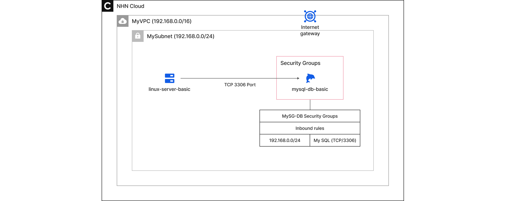
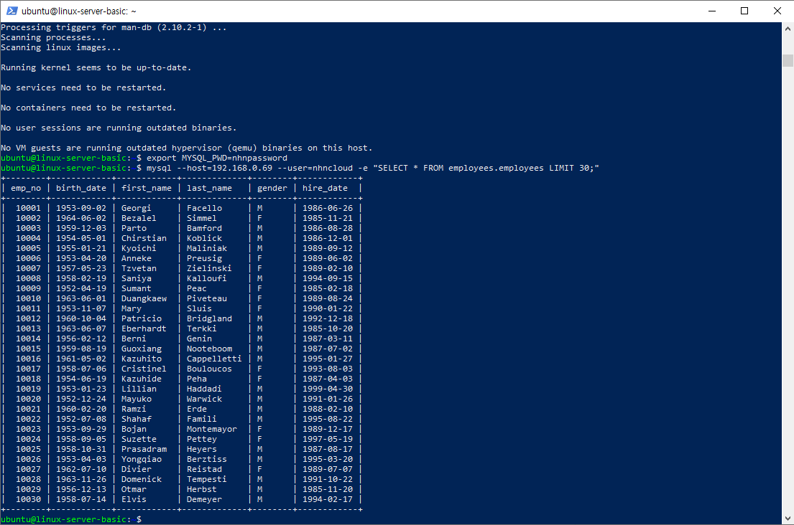

<!-- pre-align:aligned sig=a44f8078f080 -->

# Create and attach databases
**Quickstarts > 6. Create and attach databases**

This learning module will guide you through the basic configuration procedures to create a database and connect it with an application in the NHN Cloud environment. NHN Cloud provides reliable and scalable **database services** to help users build and operate databases easily and efficiently.


<a id="learning-objectives"></a>
## Learning objectives { #learning-objectives }

In this learning module, you'll learn to

* **Utilizing Database Services**
    * Creating and initializing a database instance
    * Accessing databases and working with simple data
<br></br>



<p style="text-align: center; color: black;">Final configuration diagram</p>

<a id="before-you-begin"></a>
## Before you begin { #before-you-begin }

To get started with NHN Cloud, you need to prepare the following things

* **Standard Internet browser**
    * You must have the latest version of a browser installed, such as Google Chrome, Microsoft Edge, Firefox, or Safari.
    * JavaScript and cookies must be enabled in your browser settings.
* **Internet connection environment**
    * A stable internet connection is required, with a recommended bandwidth of at least 5 Mbps.
    * You must be able to communicate securely over HTTPS.
* **Member account**
    * You must have an NHN Cloud account with a registered payment method.
    * You must be logged in to the NHN Cloud portal.

    **This guide starts after step [5. Configure security](https://docs.nhncloud.com/en/quickstarts/en/configure-security/).**

<a id="create-databases-and-query-data"></a>
## Create databases and query data { #create-databases-and-query-data }

<a id="step-1-create-a-mysql-database-instance"></a>
### Step 1. Create a MySQL database instance { #step-1-create-a-mysql-database-instance }

1. From the top menu of the NHN Cloud console, select the organization`(MyORG`), project`(MyPRJ`), and `Korea (Pyeongchon) region`that you want to use for your lab.
2. Click **Database - MySQL Instance**in the left menu of the console window.
3. Click **Create instance**.
4. In the **Create instance** window, set the information below and click **Create instance**.
    * Instance Templates
        * Enabled: `Disabled`
    * Image
        * Click Public Images > Image Name: `Ubuntu Server 20.04 LTS` 
    * Instance information
        * Availability zones: `Any availability zone.`
        * Instance name: `mysql-db-basic`
        * Instance type: **Select Instance Type** > click `t2.c1m1` in the instance type name, then click **Select** 
        * Number of instances: `1`
        * Keyfair > `MyKey`
            * To create and use additional keypairs, see [the Keypair user guide](https://docs.nhncloud.com/en/Compute/Instance/en/console-guide/#_21).
    * Root block storage
        * Block storage type: `HDD`
        * Block storage size (GB): `20` GB
    * Network settings: Select `Create network interface` 
    * Network
        * Under Available subnets, click the `MySubnet (192.168.0.0/24` ) resource to use it as the selected subnet.
    * Floating IP: Click **Change settings** 
        * Enabled: `Disabled (Default`)
    * Security groups
        * Click **Create security group** 
        * In the **Create security group** window, set the information below and click **OK**.
            * Name: `MySG-DB`
            * Click **+** for Add a security rule, and then add a security rule with the following settings
                * Direction: `Incoming`
                * IP Protocol: `My SQL`
                    * Select the appropriate IP protocol and the port information is automatically filled in.
                    > [Note] Custom TCP
                    >
                    > * If you select "Custom TCP" as the IP protocol, you can enter your own port value. Enter `3306` in the field labeled **1.**
            * Ether: `IPv4`
            * Remote: `CIDR - 192.168.0.0/24`
        * In the Success window, click **OK**.
        * In the **Security group selection**, select `MySG-DB`, which you created above.
    * Additional block storage: Disabled (default)
    * User script
        * [View Script](../static/etc/create-database-script.txt)
    * Erasure protection: Disabled (default)
4. In the Instance creation information pane, click **Create instance**.
5. The instance creation operation proceeds. The instance will be created in about a minute or so.
6. After creating the instance, **copy** and **record** IP address `that is mysql-db-basic`.

<a id="step-2-test-database-access-on-a-linux-instance"></a>
### Step 2. Test database access on a Linux instance { #step-2-test-database-access-on-a-linux-instance }

> Access the database using the Linux instance `linux-server-basic`that you created in Module 4. For instructions on creating and accessing the linux-server-basic instance, see [04-Creating a Network Setup and Instance](https://docs.nhncloud.com/en/quickstarts/en/network-setup/).

1. Run a new **terminal** or **PowerShell**.
2. Remotely connect `to linux-server-basic`with the command below.

```
#PowerShell
cd /(name of folder where MyKey.pem file is located)
```
```
ssh -i MyKey.pem ubuntu@(Floating IP address of the linux-server-basic instance)
```

* In a remote connection environment, run the command below to install the **MySQL-Client** tool.
```
#bash
sudo apt update 
sudo apt install mysql-client -y
```

* Run the command below to see the results in your database.
```
#bash
export MYSQL_PWD=nhnpassword
```
```
mysql --host=(virtual IP address of mysql-db-basic instance) --user=nhncloud -e "SELECT * FROM employees.employees LIMIT 30;"
```

Verify that **the results from the database are retrieved**.
<br></br>


<a id="references"></a>
## References { #references }

* [MySQL](https://en.wikipedia.org/wiki/MySQL)
* [Database](https://en.wikipedia.org/wiki/Database)
* [SQL](https://en.wikipedia.org/wiki/SQL)
* [RDS for MySQL](https://docs.nhncloud.com/en/Database/RDS%20for%20MySQL/en/overview/)

<a id="previous-step"></a>
## Previous step { #previous-step }

* [5. Configure security](https://docs.nhncloud.com/en/quickstarts/en/configure-security/)

<a id="next-steps"></a>
## Next steps { #next-steps }

* [7. Create and attach storage](https://docs.nhncloud.com/en/quickstarts/en/create-storage/)
